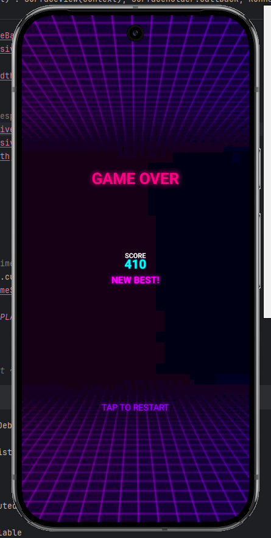

<p align="center">
  
</p>

<h1 align="center">🎮 Line vs Ball</h1>

<p align="center">
  <b>A fast-paced neon arcade game with retrowave aesthetics</b>
</p>

<p align="center">
  
  
  
</p>

---

## 🌟 About

**Line vs Ball** is an addictive arcade game where you control a paddle to keep the neon ball bouncing while avoiding falling lines. With stunning retrowave visuals, smooth 60 FPS gameplay, and satisfying combo mechanics, it's designed to provide the ultimate arcade experience.

---

## 📸 Screenshots & Demo

<p align="center">
  
</p>

### 🎬 Gameplay Video

<p align="center">
  <video src="https://github.com/JunaidJamshid123/BallVsLines-Arcade/raw/main/game_ss/demo_vid.mp4" width="300" autoplay loop muted playsinline>
    Your browser does not support the video tag.
  </video>
</p>

> *Video plays automatically. Click to download: [demo_vid.mp4](https://github.com/JunaidJamshid123/BallVsLines-Arcade/raw/main/game_ss/demo_vid.mp4)*

---

## ✨ Features

| Feature | Description |
|---------|-------------|
| 🎨 **Retrowave Aesthetics** | Purple/pink/cyan neon color scheme with glowing effects |
| 🔥 **Trail Effects** | Dynamic ball trails for that fast arcade feel |
| 💥 **Particle System** | Satisfying burst particles on every impact |
| 🎯 **Combo System** | Chain line destructions for score multipliers (x2, x3) |
| 📱 **Fully Responsive** | Adapts perfectly to any screen size |
| ⚡ **60 FPS Performance** | Butter-smooth gameplay experience |
| 🏆 **High Score Tracking** | Compete against your best scores |
| 🎮 **Multi-Ball Mode** | Unlock up to 8 balls for chaos mode |

---

## 🎮 How to Play

1. **Tap** the screen to start the game
2. **Slide** your finger left/right to move the paddle
3. **Bounce** the ball to destroy falling lines
4. **Chain** multiple line hits for combo multipliers
5. **Survive** as long as possible and beat your high score!

### 💡 Pro Tips
- Keep the ball near the center for better control
- Time your bounces to hit multiple lines
- Watch for the combo indicator to maximize your score

---

## 🛠️ Tech Stack

- **Language:** Kotlin
- **Framework:** Android SDK
- **Graphics:** Custom SurfaceView with Canvas rendering
- **Architecture:** Game loop pattern with 60 FPS target
- **Minimum SDK:** 24 (Android 7.0)

---

## 📦 Installation

### Option 1: Build from Source
```bash
# Clone the repository
git clone https://github.com/JunaidJamshid123/BallVsLines-Arcade.git

# Open in Android Studio
# Build and run on your device/emulator
```

### Option 2: Direct APK
Download the latest APK from the [Releases](../../releases) section.

---

## 🎨 Color Palette

| Color | Hex | Usage |
|-------|-----|-------|
| 🔵 Cyan | `#00FFFF` | Ball, Score text |
| 💖 Hot Pink | `#FF0080` | Lines, Game Over |
| 💜 Neon Purple | `#B464FF` | Paddle, UI accents |
| 💗 Magenta | `#FF00FF` | Combos, Special effects |

---

## 📁 Project Structure

```
LineVsBall/
├── app/src/main/java/com/example/linevsball/
│   ├── MainActivity.kt      # Entry point
│   ├── GameView.kt          # Main game logic & rendering
│   ├── Ball.kt              # Ball with trail effects
│   ├── Line.kt              # Falling lines with destruction animation
│   ├── Paddle.kt            # Player paddle with glow
│   ├── Particle.kt          # Particle burst system
│   └── FloatingText.kt      # Score popups & combos
├── app/src/main/res/
│   └── drawable/
│       └── backgroundd.jpg  # Retrowave background
└── game_ss/                 # Screenshots & demo video
```

---

## 🤝 Contributing

Contributions are welcome! Feel free to:
- 🐛 Report bugs
- 💡 Suggest new features
- 🔧 Submit pull requests

---

## 📄 License

This project is open source and available under the [MIT License](LICENSE).

---

<p align="center">
  Made with 💜 and ☕
</p>

<p align="center">
  <b>If you enjoyed this game, please ⭐ the repository!</b>
</p>
